# 🧠 MnemoGraph

**An LLM-Native Memory System with Intelligent Relationship Extraction**

MnemoGraph is a memory management system that leverages Large Language Models to understand and connect information naturally. It combines vector embeddings for semantic search with LLM-powered relationship inference to create a contextually-aware knowledge network.

> **⚠️ Development Status**: Active development. The test suite desperately needs a rewrite (yes, I know, don't judge me - it's on the list, I promise! 😅).

> **🤝 Contributions Welcome!** I'm actively seeking contributors to make MnemoGraph awesome. Whether you're fixing bugs, adding features, or improving docs - your help is valued!

> **🚀 Coming Soon: Brain-Like Retrieval System** - I'm implementing a revolutionary "RAG on Steroids" retrieval mode that mimics how human memory works. This will combine vector similarity with relationship-based traversal, temporal scoring, and multi-factor ranking to deliver unprecedented retrieval accuracy.

---

## ✨ What It Does

- **🤖 LLM-Powered Relationships**: Extracts 12 relationship types in a single call
- **🔍 Smart Context Filtering**: Multi-stage pipeline (1M+ memories → 20 relevant ones)
- **🧬 Memory Evolution**: Tracks changes, versions, and history automatically
- **♻️ Semantic Invalidation**: LLM decides what's still relevant
- **🔄 Dual-Store Architecture**: Graph (Neo4j) + Vector (Qdrant) = best of both worlds
- **💡 Derived Insights**: Discovers patterns across memories
- **⚡ REST API**: FastAPI with automatic OpenAPI docs

---

## 🔗 Relationship Types

MnemoGraph extracts 12 types of relationships in a single LLM inference:

| Type             | Description                  | Example                                   |
| ---------------- | ---------------------------- | ----------------------------------------- |
| **SIMILAR_TO**   | Semantically similar content | "Python async" ↔ "Python coroutines"      |
| **UPDATES**      | Information updates          | "Python 3.9" → "Python 3.10"              |
| **CONTRADICTS**  | Conflicting information      | "Deadline: Jan 10" ⚡ "Deadline: Jan 15"  |
| **FOLLOWS**      | Temporal/logical sequence    | Message 1 → Message 2                     |
| **PRECEDES**     | Reverse temporal order       | Setup guide ← Installation guide          |
| **PART_OF**      | Hierarchical containment     | "Neural Networks" ⊂ "Deep Learning"       |
| **BELONGS_TO**   | Category membership          | "FastAPI" ∈ "Python Frameworks"           |
| **REQUIRES**     | Prerequisite dependency      | "Advanced Tutorial" requires "Basics"     |
| **DEPENDS_ON**   | Contextual dependency        | "Code snippet" depends on "Library setup" |
| **REFERENCES**   | Direct reference/citation    | Paper references another paper            |
| **MENTIONS**     | Casual mention               | Blog post mentions a tool                 |
| **DERIVED_FROM** | Synthesized insight          | Pattern derived from multiple memories    |

---

## 🏗️ Architecture

```mermaid
graph TB
    subgraph API["🌐 API Layer"]
        FastAPI["FastAPI Server<br/>REST Endpoints"]
    end

    subgraph Engine["🧠 Memory Engine"]
        MemEngine["Memory Engine<br/>High-level API"]
        LLMRel["LLM Relationship Engine<br/>12 types in 1 call"]
        Evolution["Memory Evolution<br/>Change Detection"]
        Invalid["Invalidation Manager<br/>Relevance Checking"]
    end

    subgraph Filter["🔍 Context Filter"]
        Stage1["Stage 1: Vector<br/>1M+ → 100<br/>10-50ms"]
        Stage2["Stage 2: Hybrid<br/>100 → 50<br/>50-100ms"]
        Stage3["Stage 3: LLM<br/>50 → 20<br/>200-500ms"]
    end

    subgraph Sync["🔄 Sync Layer"]
        SyncMgr["Memory Sync Manager<br/>• Retry Logic<br/>• Validation<br/>• Repair<br/>• Batch Ops"]
    end

    subgraph Storage["💾 Storage Layer"]
        Vector["Vector Store<br/>Qdrant<br/>• Embeddings<br/>• HNSW Search"]
        Graph["Graph Store<br/>Neo4j<br/>• Nodes<br/>• Relationships"]
    end

    FastAPI --> MemEngine
    MemEngine --> LLMRel
    MemEngine --> Evolution
    MemEngine --> Invalid

    LLMRel --> Stage1
    Stage1 --> Stage2
    Stage2 --> Stage3

    MemEngine --> SyncMgr
    SyncMgr --> Vector
    SyncMgr --> Graph

    Evolution --> SyncMgr
    Invalid --> SyncMgr
    LLMRel --> SyncMgr

    style FastAPI fill:#e1f5ff
    style MemEngine fill:#fff4e1
    style LLMRel fill:#f0e1ff
    style SyncMgr fill:#e1ffe1
    style Vector fill:#ffe1e1
    style Graph fill:#ffe1e1
```



### Key Components

**🔄 Memory Sync Manager**

- Automatic retry logic with exponential backoff
- Consistency validation between stores
- Self-healing repair mechanism
- Efficient batch operations

**🤖 LLM Relationship Engine**

- Single-call extraction (all 12 types)
- Parallel execution
- Event-driven invalidation
- Derived memory creation

**🔍 Multi-Stage Context Filter**

1. **Vector Search** (10-50ms): HNSW similarity (With Adv Configs)
2. **Hybrid Filter** (50-100ms): Temporal + graph + entity
3. **LLM Pre-filter** (200-500ms): Final relevance ranking

**🧬 Memory Evolution**

- Change detection (update/augment/replace/preserve)
- Complete history tracking
- Supersession management
- Time-travel queries

**♻️ Invalidation Manager**

- On-demand validation
- Background worker
- Event-driven checks
- LLM-based relevance analysis

---

## 🚀 Quick Start

### Prerequisites

- Python 3.9+
- Docker & Docker Compose
- OpenAI API key (optional, if not using Ollama)

### Installation

```bash
# Clone repository
git clone https://github.com/vakharwalad23/mnemograph.git
cd mnemograph

# Install dependencies (choose one)
# Option 1: Using uv (recommended - faster)
uv pip install -e .

# Option 2: Using pip
pip install -e .

# Start services (Qdrant + Ollama + Neo4j)
docker compose up -d

# Wait ~30 seconds for Ollama to pull models
```

### Configuration

Create `.env` or `config.yml`:

```bash
# Copy example files
cp .env.example .env
# OR
cp config.example.yml config.yml

# Then edit with your settings
```

**Key settings to configure:**

- `LLM_PROVIDER`: `ollama` or `openai`
- `LLM_MODEL`: `llama3.1:8b` or `gpt-4o-mini`
- `EMBEDDER_PROVIDER`: `ollama` or `openai`
- `EMBEDDER_MODEL`: `nomic-embed-text` or `text-embedding-3-small`
- `OPENAI_API_KEY`: Your OpenAI key (if using OpenAI)
- `OLLAMA_BASE_URL`: `http://localhost:11434` (if using Ollama)

For full configuration options, see the Configuration Options section below.

### Start the Server

```bash
python main.py
```

Access at:

- **API**: http://localhost:8000
- **Docs**: http://localhost:8000/docs

---

## 💡 Usage

### REST API Endpoints

| Method   | Endpoint           | Description       |
| -------- | ------------------ | ----------------- |
| `POST`   | `/memories`        | Add memory        |
| `GET`    | `/memories/{id}`   | Get memory        |
| `PUT`    | `/memories/{id}`   | Update memory     |
| `DELETE` | `/memories/{id}`   | Delete memory     |
| `POST`   | `/memories/search` | Semantic search   |
| `GET`    | `/stats`           | System statistics |
| `GET`    | `/health`          | Health check      |

---

## ⚙️ Configuration Options

### LLM Relationships

| Parameter                  | Default | Description                          |
| -------------------------- | ------- | ------------------------------------ |
| `min_confidence`           | 0.5     | Min confidence for relationships     |
| `min_derived_confidence`   | 0.7     | Min confidence for insights          |
| `context_window`           | 50      | Max candidates for LLM               |
| `recent_window_days`       | 30      | Temporal context window              |
| `graph_depth`              | 2       | Graph traversal depth                |
| `enable_derived_memories`  | true    | Auto-generate insights               |
| `enable_auto_invalidation` | true    | Check for supersession automatically |

### Memory Evolution

| Parameter             | Default | Description             |
| --------------------- | ------- | ----------------------- |
| `preserve_history`    | true    | Keep all versions       |
| `auto_detect_updates` | true    | Use LLM for changes     |
| `max_version_history` | 100     | Max versions per memory |
| `enable_time_travel`  | true    | Historical queries      |

### Qdrant Vector Store

| Parameter           | Default               | Description             |
| ------------------- | --------------------- | ----------------------- |
| `url`               | http://localhost:6333 | Qdrant server           |
| `collection_name`   | memories              | Collection name         |
| `use_grpc`          | true                  | Faster than HTTP        |
| `hnsw_m`            | 16                    | HNSW graph connections  |
| `hnsw_ef_construct` | 100                   | Construction accuracy   |
| `use_quantization`  | true                  | Compress vectors (int8) |
| `on_disk`           | false                 | Use memory for speed    |

### Neo4j Graph Store

| Parameter  | Default               | Description      |
| ---------- | --------------------- | ---------------- |
| `uri`      | bolt://localhost:7687 | Neo4j connection |
| `user`     | neo4j                 | Username         |
| `password` | -                     | Password         |
| `database` | neo4j                 | Database name    |

---

## 🛠️ Tech Stack

- **LLM**: Ollama / OpenAI
- **Vector Store**: Qdrant (HNSW indexing - Advanced configs available)
- **Graph Store**: Neo4j
- **Embeddings**: Ollama (nomic-embed-text) / OpenAI (text-embedding-3-small)
- **API**: FastAPI
- **Testing**: pytest _(needs serious refactoring, we're aware!)_

---

## 📝 License

MIT License

---

## 🙏 Acknowledgments

Built on cognitive science research and modern LLM infrastructure. Thanks to the open-source AI/ML community.

### Design Philosophy

1. **LLMs understand context**: One LLM call beats many specialized algorithms
2. **Filter before processing**: 1M → 100 → 50 → 20 makes LLM processing practical
3. **Semantic invalidation**: LLMs know relevance better than decay formulas
4. **Relationships need reasoning**: Know _why_, not just _what_
5. **Memory evolves**: Track changes, preserve history

---

<div align="center">

**MnemoGraph** - _LLM-Native Memory System_ 🧠✨

[]()
[]()
[]()

</div>
